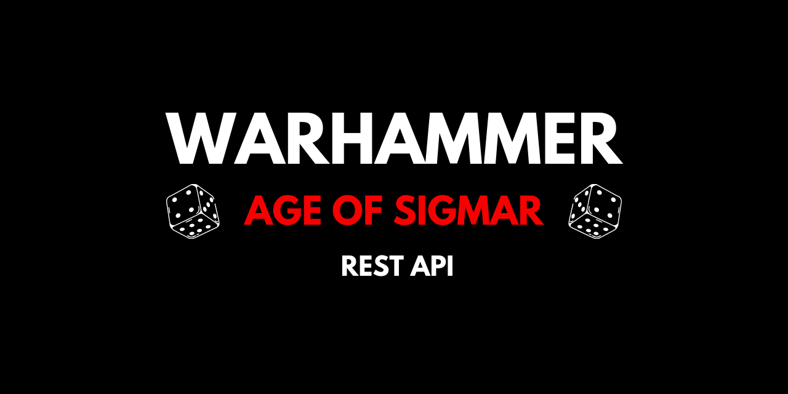

# Warhammer - Age of Sigmar API ⚔️

A REST API for public Warhammer Age of Sigmar data. Built with Go + Lambda.



[](https://pkg.go.dev/github.com/brittonhayes/warhammer-aos)

[](https://goreportcard.com/report/github.com/brittonhayes/warhammer-aos)

[](https://github.com/brittonhayes/warhammer-aos/actions/workflows/validate.yml)

## Usage ⚡

The API is free and public. Try it out!

### 🌐 [aos-api.com/armies](https://aos-api.com/armies)

## Docs 📝

Looking for API documentation? We've got 'em! Our documentation covers 
everything you can request from our API.

### 🌐 [docs.aos-api.com](http://docs.aos-api.com/)

---

## Development 🔧

### Setup

> If you'd like to contribute to the request handling and inner-workings of the API, you'll need a few things set up in your development environment.

1. [Install Taskfile.dev](https://taskfile.dev/#/)
2. [Setup Go](https://golang.org/doc/install)
3. Enjoy 🎉

### Commands

```shell
# Build the lambda handlers
task build

# Run the lambda handlers locally
task invoke

# Run the tests
task test
```

## Contributing

> Wanna contribute _your_  Warhammer mini data to the API?
>
> We'd love your contributions!
> We've tried to make it as easy as possible for people to add their info without needing to understand the code.
>
> Check out our [contributing page](https://github.com/brittonhayes/warhammer-aos) to get started!

## Show your support

Give a ⭐️ if this project helped you!
